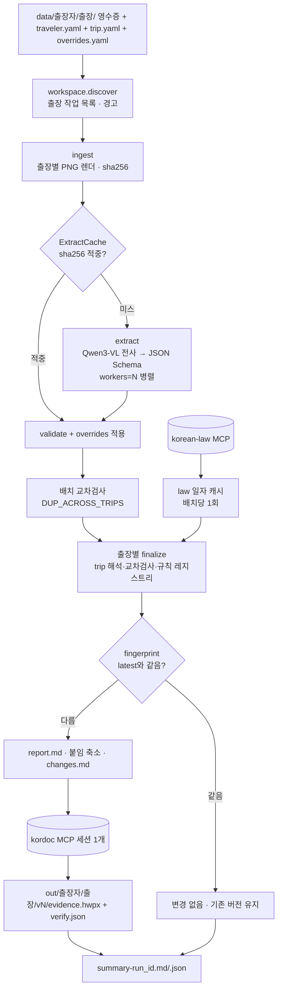

# 출장여비 영수증 증빙서류 HWPX 자동화 — 설계 문서 (v2: 다건·일괄·추가 제출 확장)

작성일 2026-09-13 / 대상 프로젝트 `/Users/bcchung81/Downloads/데모 시연2`

## 0. 확정된 결정 (2026-09-13 Q&A)

| 항목 | 결정 |
|---|---|
| 확장 범위 | 한 출장에 영수증 다수 · 여러 출장 한꺼번에 · 여러 출장자 일괄 · 같은 출장에 추가 제출 — **모두 지원** |
| 개발 범위 | 코어(CLI + Claude Code 스킬) 먼저. 웹 화면(C안 디자인)은 다음 단계 |
| 증빙 서식 | 기관 서식 없음 → kordoc `generate_document`(보고서 프리셋) 자동 생성 |
| 문서 단위 | 출장 1건 = HWPX 1개 |
| 입력 구조 | `data/<출장자>/<출장폴더>/` — 폴더 = 출장 |
| 출장 정보 | `trip.yaml` 우선, 없으면 영수증으로 자동 제안(확인필요로 표시) |
| 추가 제출 | 기존 문서는 두고 새 버전(v1, v2 …)으로 저장, 변경 내역 기록 |
| 기본값(질문 생략) | 여비 구분은 `traveler.yaml`에서 받고 없으면 확인필요, VLM 8B Q4_K_M, 동시 처리 1(설정 가능) |

## 1. 목표 / 비목표

### 목표
1. `data/<출장자>/<출장>/`의 영수증(jpg/png/pdf)을 **로컬 Qwen3-VL(llama-server)** 로 전사·구조화한다. 이미지는 외부로 나가지 않는다.
2. **korean-law MCP**로 「공무원 여비 규정」 현행 조문·별표를 조회해 일자별로 캐시하고, 별표 2를 결정론 파서로 `RateTable`로 변환한다.
3. 결정론 규칙엔진이 영수증별로 판정(지급/감액지급/불인정/확인필요)하고 인정액과 근거조문을 낸다. 출장 안·출장 사이 교차검사를 하고, 일비·식비 정액 행을 더한다.
4. **kordoc MCP**로 출장별 "출장여비 영수증 증빙내역서" HWPX를 버전 단위로 생성한다. 만든 문서를 역파싱해 합계를 대조한다.
5. 한 번의 실행으로 여러 출장자·여러 출장을 일괄 처리하고 요약표를 만든다. 영수증을 추가하면 새 영수증만 VLM으로 읽는다.

### 비목표
- 웹 UI(다음 단계), 회계시스템 연동, 전자결재 상신, 증빙 위변조 판별.
- 기관 서식 hwpx 채우기(`fill_form`) — 서식이 생기면 export에 경로를 추가한다.
- 국외여비(별표 4), 이전비·가족여비.
- 영수증만으로 출장자를 자동 판별하는 기능. 폴더가 출장자를 정한다(KTX 스크린샷에는 이름이 없음).

## 2. 아키텍처



- 구현: Python 패키지 `receipt_evidence`(`uv`, `requires-python >=3.12`) + CLI `receipt-evidence` + Claude Code 스킬 `.claude/skills/receipt-evidence/SKILL.md`.
- MCP는 파이썬 `mcp` SDK로 직접 실행한다. `StdioToolCaller`를 `with`로 열면 백그라운드 스레드에서 세션 하나를 유지해, 출장이 수십 건이어도 `npx` 기동은 1회다. `with` 밖에서 부르면 호출마다 1회성 세션을 연다.
- llama.cpp `/v1/chat/completions`는 `response_format` `json_schema`와 `json_object`+`schema`를 지원한다. 1차 json_schema, 400 또는 파싱 실패 시 json_object, 마지막으로 느슨한 JSON 파싱으로 폴백한다.
- korean-law 응답은 텍스트(`MST: 287535`, `[현행]`)와 HTML 표이므로 정규식·HTMLParser로 파싱한다. kordoc은 법령 코드 표기를 자동 제거하므로 본문에는 MST를 쓰지 않는다.

## 3. 디렉터리 계약

### 입력
```
data/
└─ <출장자>/                         폴더명 = 출장자 이름
   ├─ traveler.yaml                  선택: position, grade(제1호/제2호), org, dept, workplace_region, approval
   └─ <YYYY-MM-DD>_<출장지>[_메모]/   폴더 = 출장 1건 (예: 2026-07-09_서울)
      ├─ trip.yaml                   선택: start_date, end_date, destination_region, purpose, route_stations,
      │                              lodging_region, over_cap_reason, taxi_reason, official_vehicle,
      │                              within_workplace, duration_hours
      ├─ overrides.yaml              선택: 영수증별 사용자 확인값 {receipt_id: {필드: 값, clear_warnings: [코드]}}
      └─ *.jpg / *.png / *.pdf       영수증 (여러 쪽 PDF = 1건)
```
- `data/` 루트나 출장자 폴더에 바로 놓인 영수증은 처리하지 않고 경고로 알린다.
- 현재 `data/`는 평면 구조다(KTX 2장 + 숙박 PDF). 실제 실행 전에 `data/정백철/2026-07-09_서울/`로 옮겨야 한다. 옮기기 전에 사용자에게 확인한다.

### 출력
```
out/
├─ .cache/extract/p1/<sha256>.json   원본 해시별 전사문 + 구조화 JSON (PROMPT_VERSION=p1)
├─ .cache/law/<YYYY-MM-DD>.json      법령 스냅샷 일자 캐시
├─ run-<run_id>.log                  파일 경로·건수·판정만 (전사문·카드번호 금지)
├─ summary-<run_id>.md / .json       출장자·출장별 버전·상태·청구·인정·확인필요·검증·문서 경로
└─ <출장자>/<출장>/
   ├─ latest.json                    {"version": N, "fingerprint": "..."}
   ├─ work/                          manifest.json, images/, transcripts/, receipts.json, trip.proposed.yaml(자동 제안 시)
   └─ v<N>/                          report.md, decisions.json, fingerprint.json, attachments/*.jpg,
                                     evidence.hwpx, verify.json, result.json, changes.md(N≥2)
```

## 4. 확장성 메커니즘

| 상황 | 메커니즘 |
|---|---|
| 한 출장에 영수증 수십 장 | 영수증 캐시(원본 sha256 + PROMPT_VERSION) · `workers=N` 병렬 추출(`llama-server -np N`) · 영수증별 실패 격리(EXTRACT_FAILED) · 붙임 이미지 긴 변 1600px JPEG 축소 · 보고서 기준일→구분 정렬 |
| 여러 출장 한꺼번에 | 폴더 단위 작업 목록 · 법령 배치당 1회(일자 캐시) · kordoc 세션 재사용 · 출장 하나가 실패해도 나머지 계속(`error` 기록) |
| 여러 출장자 일괄 | 출장자별 `traveler.yaml` · `--traveler`/`--trip` 필터 · `summary-<run_id>.md/.json` |
| 같은 출장 추가 제출 | 파일 추가 후 재실행 → 캐시 적중으로 새 영수증만 VLM 처리 → fingerprint 변화 → `v<N+1>` + `changes.md` |
| 사용자 확인값 반영 | `overrides.yaml`(원본 옆에 보관, 매 실행 재적용) → fingerprint 변화 → 새 버전 |
| 새 영수증 종류 | 규칙 레지스트리 `RULES: dict[Category, handler]`에 핸들러 1개 추가, `RULES_VERSION` 올림 |

fingerprint = sha256(정규화 JSON: 영수증 판정 관련 필드 + 해석된 trip + 법령 MST·시행일 + RULES_VERSION). `latest.json`과 같으면 새 버전을 만들지 않는다. `--new-version`을 주면 강제로 만든다.

## 5. 핵심 데이터 모델 (Pydantic v2, `src/receipt_evidence/models.py`)

| 모델 | 필드 |
|---|---|
| `Category(str, Enum)` | `RAIL="철도"`, `BUS="버스"`, `AIR="항공"`, `TAXI="택시"`, `LODGING="숙박"`, `MEAL="식사"`, `OTHER="기타"`, `UNKNOWN="미상"` |
| `ReceiptImage` | `image_id`(sha256 앞 12자+`-p{page}`), `source_path`, `page`, `png_path`, `sha256`, `width`, `height` |
| `Receipt` | `receipt_id`(=첫 쪽 image_id), `image_id`, `sha256`, `category`, `merchant`, `business_no`, `amount`, `paid_at`, `service_date`, `service_end_date`, `origin`, `destination`, `seat_class`, `train_no`, `approval_no`, `card_masked`, `payer_name`, `region`, `nights`, `transcript_path`, `raw`, `warnings`, `confidence` |
| `RateTable` | `grade`, `rail`, `ship`, `air`, `car`, `daily_allowance`, `lodging`, `lodging_caps`(제2호 `{"서울특별시":100000,"광역시":80000,"그 밖의 지역":70000}`), `meal_allowance` |
| `LawSnapshot` | `law_name`, `law_id`, `mst`, `promulgated`, `effective`, `fetched_at`, `annexes`, `articles`, `rate_tables` |
| `TravelerProfile` | `name`, `position`, `grade`, `org`, `dept`, `workplace_region`, `approval` |
| `TripConfig` | `traveler_name`, `trip_id`, `position`, `grade`, `org`, `dept`, `workplace_region`, `destination_region`, `start_date`, `end_date`, `purpose`, `route_stations`, `lodging_region`, `over_cap_reason`, `taxi_reason`, `official_vehicle`, `within_workplace`, `duration_hours`, `approval`, `template_fields`, `proposed`, `proposal_basis`; 프로퍼티 `days` |
| `Verdict` / `Decision` | `PAY/REDUCED/DENIED/REVIEW` / `receipt_id`, `item`, `claimed_amount`, `approved_amount`, `verdict`, `basis`, `reasons` |
| `PipelineResult` | `run_id`, `traveler`, `trip_id`, `trip`, `law_mst`, `law_effective`, `receipts`, `decisions`, `totals`, `review_items`, `report_md_path`, `hwpx_path`, `version`, `skipped`, `changes_md_path`, `verify_ok`, `cache_hits`, `cache_misses`, `error` |
| `BatchResult` | `run_id`, `results`, `warnings`, `summary_md_path`, `summary_json_path` |

## 6. 규칙엔진 (`rules.py`)

공통 선행 검사(순서대로, 먼저 걸리면 종료):
| 조건 | 판정 | 근거·사유 |
|---|---|---|
| `amount is None` 또는 차단 경고(검증: `MISSING_AMOUNT`,`AMOUNT_NOT_IN_TRANSCRIPT`,`BIZNO_CHECKSUM`,`DUP_APPROVAL`,`EXTRACT_FAILED`,`MISSING_DATE` / 교차: `LODGING_OVERLAP`,`LODGING_NIGHTS_EXCEED`,`DUP_TICKET`,`DUP_ACROSS_TRIPS`) | 확인필요(0) | 경고 코드를 한국어 사유로 표기 |
| `within_workplace`이고 운임·숙박 | 불인정 | 제18조 |
| 기준일(`service_date`, 없으면 `paid_at`)이 출장기간 밖 | 확인필요(0) | 출장기간 불일치 |
| `grade is None`이고 철도·숙박 | 확인필요(0) | 별표 1 구분 미확정 |

카테고리 핸들러(레지스트리):
| 카테고리 | 조건 | 판정 / 인정액 | 근거 |
|---|---|---|---|
| 철도 | 경로 역 불일치 | 확인필요 | 출장 경로 |
| 철도 | 제2호 특실 | 확인필요 | 일반실 차액 |
| 철도 | 그 외 | 지급 / 실비 | 별표2 {구분} 철도운임, 비고 6 |
| 버스 / 항공 | — | 지급 / 실비 | 별표2 비고 3 / 제12조 |
| 택시 | 사유 있음 / 없음 | 지급 / 확인필요 | 제13조 |
| 숙박 | 제1호 | 지급 / 실비 | 별표2 제1호 |
| 숙박 | 제2호, 지역 미확인 | 확인필요 | 상한 지역 판정 불가 |
| 숙박 | 제2호, ≤ 상한×박 | 지급 | 별표2 제2호, 제16조④ |
| 숙박 | 제2호, 초과 + 사유 | ≤ 130%면 지급, 초과면 감액(130%) | 제16조①단서 |
| 숙박 | 제2호, 초과, 사유 없음 | 감액(상한×박) | 별표2 제2호 |
| 식사 | — | 불인정 | 제16조⑤ |
| 기타·미상 | — | 확인필요 | 분류 불가 |

교차검사:
| 코드 | 범위 | 조건 |
|---|---|---|
| `LODGING_OVERLAP` | 출장 안 | 숙박 [체크인, 체크아웃 또는 체크인+박수) 구간이 겹침 |
| `LODGING_NIGHTS_EXCEED` | 출장 안 | 숙박 박수 합계 > 출장일수 − 1 |
| `DUP_TICKET` | 출장 안 | 같은 구분·편명·날짜·출발·도착 |
| `DUP_APPROVAL` | 출장 안 | 승인번호 중복(validate) |
| `DUP_ACROSS_TRIPS` | 배치 | 같은 원본 sha256이 두 출장 폴더에 있음 |

정액 행: 일비 `25,000×일수`(공용차량 ½), 식비 `25,000×일수`, 근무지 내 출장은 제18조 정액. **자동 제안 출장(`proposed`)이면 일비·식비는 확인필요(인정 0, 예정액을 사유에 표기)** 로 처리한다.

## 7. 출장 자동 제안 (`trip.yaml`이 없을 때)
- 폴더명 `^(\d{4}-\d{2}-\d{2})_([^_]+)` → 시작일 후보, 출장지.
- 기간은 `service_date`(운행일·체크인)·`service_end_date`가 있는 영수증과 폴더 날짜로만 계산한다. **결제일(`paid_at`)만 있는 영수증은 제외**한다. 그러지 않으면 8/21 숙박 결제가 기간을 7/9~8/21로 부풀린다.
- 철도 출발·도착역으로 `route_stations`를 정한다.
- `proposed=True`, `proposal_basis`에 근거를 기록하고 `work/trip.proposed.yaml`을 쓴다. 사용자가 확인해 `data/…/trip.yaml`로 저장하면 다음 실행에서 새 버전이 된다.

## 8. 오류·Human-in-the-loop

| 지점 | 동작 |
|---|---|
| 출장 폴더 없음 | `ValueError` — "data/<출장자>/<출장>/ 구조" 안내 |
| llama-server 미기동 | 캐시 미스가 있을 때만 `/health` 확인, 실패 시 중단 |
| VLM JSON 실패 | json_schema → json_object → 느슨 파싱 → 실패 시 `UNKNOWN` + `EXTRACT_FAILED`, 캐시에 저장하지 않음(재실행 시 재시도) |
| korean-law 파싱 실패 | `LawParseError`로 배치 중단(추정값 금지) |
| 출장 1건 finalize 실패 | 해당 결과에 `error` 기록, 나머지 출장은 계속, 요약에 "오류", CLI exit 2 |
| 합계 불일치 | `verify.json ok=false`, CLI exit 3 |
| 확인필요 | 요약·HWPX "확인필요 사항"에 표기 → 사용자가 `trip.yaml`·`overrides.yaml` 수정 → 재실행하면 새 버전 |

## 9. 개인정보·보안
- 영수증 이미지·전사문은 로컬 디스크와 로컬 llama-server 사이에서만 이동한다. 외부로 나가는 것은 korean-law 질의어뿐이다.
- 카드번호는 마스킹 형태만 저장하고, 16자리 연속 숫자는 앞 6·뒤 2자리만 남긴다. 보고서·HWPX에는 카드번호를 넣지 않는다.
- 로그에는 전사문·카드번호·이메일을 쓰지 않는다.
- `.gitignore`: `out/`, `data/`, `.venv/`, `*.hwpx`, 디자인 캔버스 산출 HTML.

## 10. 위험요소와 완화

| 위험 | 완화 |
|---|---|
| VLM 오인식 | 전사문 금액·승인번호 대조, 사업자번호 체크섬, 중복 검사 → 확인필요. 사용자는 `overrides.yaml`로 교정 |
| 프롬프트 변경 후 오래된 캐시 | 캐시 경로에 `PROMPT_VERSION` 포함 → 프롬프트를 바꾸면 버전을 올림 |
| 규정 개정 | 매 배치 현행 MST 확인(일자 캐시), fingerprint에 MST·시행일 포함 → 개정되면 새 버전 |
| 규칙 변경 | `RULES_VERSION`이 fingerprint에 포함 |
| 대량 처리 속도 | `--workers N` + `VLM_PARALLEL=N`, MCP 세션 재사용, 캐시 |
| 붙임 이미지로 HWPX 비대 | 긴 변 1600px JPEG 축소 |
| 출장 폴더 오배치 | 기간 검사·교차검사로 확인필요 |

## 11. data/ 3건 기대 결과
전제: `data/정백철/2026-07-09_서울/`에 배치, `traveler.yaml`(제2호, 근무지 나주), `trip.yaml`(2026-07-09~07-10, 서울, 경로 나주·용산).

| 실행 | 입력 | 기대 |
|---|---|---|
| 1차 | KTX 2장 | v1 · 청구 96,400 · 인정 196,400(철도 96,400 + 일비·식비 100,000) · 확인필요 0 |
| 2차 | + 숙박 PDF | v2 · VLM은 PDF만 처리(캐시 적중 2) · 청구 196,400 · 인정 196,400 · 확인필요 100,000(결제 8/21 기간 밖·지역 미확인) · changes.md에 숙박비 추가 |
| 3차 | + `overrides.yaml`(숙박일 2026-07-09, 지역 서울) | v3 · VLM 호출 0 · 숙박 지급 100,000 · 인정 296,400 |
| 4차 | 변경 없음 | 새 버전 없음(변경 없음) |

## 12. 남은 확인 사항 (구현 중·실행 전)
1. 실제 `data/` 파일을 `data/정백철/2026-07-09_서울/`로 옮겨도 되는지(실행 전 확인).
2. `traveler.yaml`의 여비 구분·근무지·결재선, `trip.yaml`의 출장 목적.
3. 숙박 영수증의 실제 숙박일·지역(확인되면 `overrides.yaml`).
