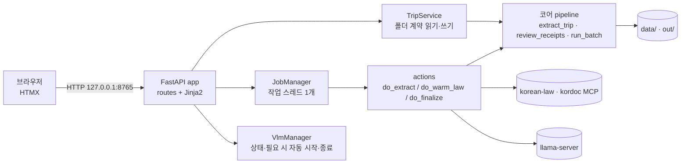

# 여비정산 증빙 웹앱 (C안) — 설계 문서

작성일 2026-09-13 / 기반: 코어 설계 `2026-09-13-receipt-evidence-design.md`(v2), 화면 시안 `docs/design/receipt-evidence-ui/`(C안 코믹 패널)

## 0. 확정된 결정 (Q&A)

| 항목 | 결정 |
|---|---|
| 사용 환경 | 이 Mac에서 혼자. `127.0.0.1`에서만 열고 로그인은 없음 |
| 기술 스택 | FastAPI + Jinja2 템플릿 + HTMX(저장소에 포함, CDN 미사용) |
| 화면 범위 | 출장 목록 홈(C안 스타일로 신규) + C안 4화면(올리기·읽은 값 확인·판정 검토·서류 완성) |
| VLM 서버 | 웹에서 상태만 표시. **필요할 때만 자동으로 켜고 끝나면 끈다**(2026-09-13 사용자 요청으로 '시작 버튼'안을 대체): 새로 읽을 영수증(캐시 미스)이 있을 때만 llama-server를 띄워 준비될 때까지 기다린 뒤, 추출이 끝나면 웹앱이 켠 서버를 종료한다. CLI `run`도 같다 |
| 기본값(질문 생략) | 긴 작업은 단일 작업 스레드 + HTMX 폴링(2초). 여비 구분·근무지·결재선은 올리기 화면의 출장 정보 칸에서 입력. 저장 형식은 코어의 YAML 계약 그대로. HWPX는 다운로드와 kordoc HTML 미리보기 |

## 1. 목표 / 비목표

### 목표
1. 브라우저에서 출장을 만들고 영수증을 올린다. 출장자 설정(`traveler.yaml`)과 출장 정보(`trip.yaml`)를 입력한다.
2. 로컬 VLM으로 읽은 값을 원본 이미지 옆에서 확인·수정한다. 수정값은 `overrides.yaml`에 저장한다.
3. 판정 결과(지급/확인필요·근거·합계)를 보고, 확인필요 사유를 화면에서 바로 해소한다(trip.yaml·overrides.yaml).
4. HWPX 증빙내역서를 만들어 미리보기·다운로드한다. 버전 이력과 변경 내역을 본다.
5. 홈에서 여러 출장자·출장의 상태(단계·버전·인정액·확인필요)를 한눈에 본다.

### 비목표
- 로그인·다중 사용자·원격 접속, 배포.
- 코어 규칙·추출 로직 변경(웹 연동에 필요한 최소 보강만).
- 기관 서식 채우기, 일괄 요약 화면(CLI `run`이 담당).

## 2. 아키텍처

- 패키지: `src/receipt_evidence/web/` — `app.py`(앱 팩토리·라우트), `service.py`(파일 계약), `jobs.py`(작업), `vlm_process.py`(VLM 프로세스), `actions.py`(작업 본문), `templates/`, `static/`.
- 작업 스레드는 1개다. VLM 슬롯 1개와 MCP 세션을 순서대로 쓰고, 같은 출장에 같은 작업이 중복 제출되면 기존 작업을 돌려준다.
- 상태는 파일에서 다시 계산한다(서버를 재시작해도 유지). 메모리에는 진행 중 작업만 둔다.

## 3. 화면과 라우트

| 화면 | 라우트 | 내용 |
|---|---|---|
| 홈 | `GET /` | 헤더(로고·VLM 상태·새 정산), 출장자별 출장 카드(기간·영수증 수·단계 칩·버전·인정액·확인필요 스티커) |
| VLM | `GET /vlm` | 상태 배지 조각(준비됨·켜는 중·꺼짐 — 필요할 때 자동으로 켜요). starting이면 3초마다 갱신 |
| 새 정산 | `GET /new`, `POST /new` | 출장자·여비 구분·근무지·결재선·출장지·기간·목적 + 영수증 파일 → 폴더 생성 후 1화면으로 |
| 1 올리기 | `GET /t/{출장자}/{출장}/upload`, `POST …/files`, `POST …/files/delete`, `POST …/info`, `POST …/extract` | 드롭존·파일 목록·삭제, 출장 정보 저장, "영수증 읽기 시작" |
| 2 읽은 값 확인 | `GET …/extract?rid=`, `POST …/receipts/{rid}`, `GET …/image/{image_id}` | 작업 중이면 진행 표시. 완료되면 영수증 목록·원본 이미지·필드 편집·경고 해제 |
| 3 판정 검토 | `GET …/review`, `POST …/resolve`, `POST …/finalize` | 합계 카드·"잠깐, 확인!" 스티커·확인필요 해소 폼·판정 표, "HWPX 증빙서류 만들기" |
| 4 서류 완성 | `GET …/result`, `GET …/v/{n}/evidence.hwpx`, `GET …/v/{n}/preview`, `GET …/v/{n}/changes` | 미리보기(iframe)·다운로드·합계 검증·버전 이력·변경 내역 |
| 작업 상태 | `GET …/job` | 진행 조각. 완료·오류 시 `HX-Refresh: true` |

모든 화면 상단에 C안 4단계 패널을 두고 현재 단계는 노랑, 완료는 크림+시안 체크, 남은 단계는 점선으로 표시한다.

## 4. 상태 모델

`TripSummary`(홈·단계 패널용, 파일에서 계산):
- `files`: 출장 폴더의 영수증 파일 수
- `extracted`: `out/…/work/receipts.extracted.json` 존재
- `stale`: 추출 후 파일이 바뀜(현재 파일 sha256 집합 ≠ manifest의 sha256 집합)
- `version`, `approved`, `claimed`, `review_count`, `verify_ok`: `latest.json` → `v<N>/result.json`
- `proposed`: trip.yaml 없음(자동 제안 상태)
- `stage`: `empty`(파일 없음) → `uploaded` → `extracted` → `documented`(버전 있음, 이후 입력이 바뀌면 다시 `extracted`)

## 5. 데이터 쓰기 규칙

| 입력 | 저장 위치 | 규칙 |
|---|---|---|
| 출장자 설정 | `data/<출장자>/traveler.yaml` | position, grade, org, dept, workplace_region, approval(쉼표 구분 → 목록). 빈 값은 키 제거 |
| 출장 정보·해소값 | `data/<출장자>/<출장>/trip.yaml` | `TRIP_YAML_FIELDS`만 병합 저장. 빈 값은 null |
| 영수증 파일 | `data/<출장자>/<출장>/` | 확장자 jpg·jpeg·png·pdf만, 1개 30MB 이하. 파일명은 경로 성분 제거·NFC. 같은 이름이 있으면 `-2` 접미 |
| 읽은 값 수정 | `data/<출장자>/<출장>/overrides.yaml` | VLM 추출값과 다른 필드만 기록. 추출값으로 되돌리면 키 제거. `clear_warnings` 병합 |
| 새 출장 | 폴더명 `YYYY-MM-DD_<출장지>` | 출장자·출장지는 NFC, `/ \ NUL` 불가, `.`으로 시작 불가, 60자 이하 |

## 6. 코어 보강 (웹 연동용 최소 변경)

- `prepare_trip`: 검증 직후 `work/receipts.extracted.json`(overrides 적용 전)을 추가로 저장한다. 웹은 이것과 `overrides.yaml`로 즉시 화면을 계산한다(VLM·재렌더 없음).
- `review_receipts(job, receipts, law) -> TripReview`: trip 해석·교차검사·판정·합계를 파일 생성 없이 계산한다. `finalize_trip`이 이것을 재사용한다.
- `extract_trip(data_dir, out_dir, clients, traveler, trip_id, opts) -> TripWork`: 출장 1건 ingest와 추출. 캐시 미스가 있을 때만 VLM 상태를 확인한다.
- `run_batch(..., summary: bool = True)`: 웹의 출장 1건 문서 생성에서는 요약 파일을 쓰지 않는다.
- `run_batch`·`extract_trip`에 `on_vlm_needed: Callable[[], None] | None`: 캐시 미스가 있고 VLM이 응답하지 않을 때 호출한다(자동 시작 훅). 호출 뒤에도 응답이 없으면 기존처럼 RuntimeError.
- `VlmManager.ensure_ready(timeout)`: 꺼져 있으면 `scripts/start_vlm.sh`를 띄우고 `/health`가 ok가 될 때까지 기다린다(기본 180초). 시간 초과나 프로세스 종료 시 RuntimeError. `stop()`은 자신이 띄운 서버만 종료한다. 웹의 추출 작업과 CLI `run`은 끝나면(성공·실패 모두) `stop()`을 호출한다.

## 7. 보안 (로컬 전용)

- 바인드는 루프백만 허용한다. CLI `web`은 `127.0.0.1`/`localhost`/`::1`이 아닌 호스트를 거부한다.
- `TrustedHostMiddleware`로 Host를 `127.0.0.1`/`localhost`만 허용한다(DNS 리바인딩 방지).
- 상태 변경 요청(POST)은 `Origin`이 있으면 같은 출처만 허용한다(다른 사이트에서 로컬 앱으로 보내는 요청 차단).
- 경로 성분(출장자·출장·파일명·image_id·버전)은 검증 후 `data/`·`out/` 하위로 resolve되는지 확인한다. 실패하면 400/404.
- 미리보기 HTML은 `Content-Security-Policy: default-src 'none'; style-src 'unsafe-inline'; img-src data:; font-src data:`와 `sandbox` iframe으로 띄운다.
- 로그·화면 오류 메시지에 전사문·카드번호를 넣지 않는다(기존 원칙 유지).

## 8. 오류 처리

| 상황 | 동작 |
|---|---|
| VLM 꺼짐 + 추출 필요 | 자동으로 켜고 기다린다. 180초 안에 준비되지 않거나 프로세스가 죽으면 작업 오류 → 2화면 오류 패널(메시지 + 다시 읽기) |
| 파일 없음에서 읽기 시작 | 1화면에 "영수증을 먼저 올려 주세요" |
| 추출 후 파일 변경(stale) | 2·3화면 상단에 "파일이 바뀌었어요 — 다시 읽기" 배너와 버튼 |
| 법령 캐시 없음 | 3화면 진입 시 법령 조회 작업을 제출하고 진행 표시 |
| 문서 생성 실패(kordoc) | 4화면 오류 패널(예외 요약), 이전 버전은 유지 |
| 미리보기 렌더 실패 | 미리보기 자리에 "미리보기를 만들지 못했어요", 다운로드는 가능 |
| 잘못된 경로·확장자·크기 | 400 + 사유 |

## 9. 디자인 이식

- C안 토큰: 배경 `#F2ECDD`, 종이 `#FAF8F2`, 잉크 `#08080C`, 노랑 `#FFD23F`, 오렌지 `#FF7A2F`, 마젠타 `#FF2FA8`, 시안 `#2FF0E6`. 테두리 3px, 오프셋 그림자 `6px 6px 0`, 모서리 16px.
- 서체: Do Hyeon(제목)·Gothic A1(본문)·Anton(숫자)는 Google Fonts, 오프라인일 때는 `Apple SD Gothic Neo`·`Impact` 폴백.
- 시안의 인라인 스타일을 `static/app.css` 클래스로 옮긴다(`.panel`, `.step`, `.step--current|done|future`, `.chip--pay|review`, `.sticker`, `.cta` 등).
- 홈은 같은 어휘로 새로 구성한다: 출장 카드 = `.panel` + 단계 칩 + Anton 인정액 + 확인필요 스티커.

## 10. 테스트 전략

- `TripService`·`JobManager`·`VlmManager`·`actions`는 임시 폴더와 가짜(`ColorVlm`, `FakeToolCaller`, 가짜 Popen)로 단위 테스트한다.
- 라우트는 FastAPI `TestClient` + `inline` 작업 모드(동기 실행)로 화면별 E2E를 테스트한다: 새 정산 → 올리기 → 읽기 → 수정 → 판정 → 해소 → 문서 → 다운로드.
- 보안: 경로 조작, 교차 출처 POST, 허용 안 된 Host, 확장자·크기 제한.
- 연동(`integration`): 실제 VLM·MCP로 TestClient 전체 흐름을 검증한다. 수동으로는 브라우저 스크린샷으로 C안과 비교한다.
